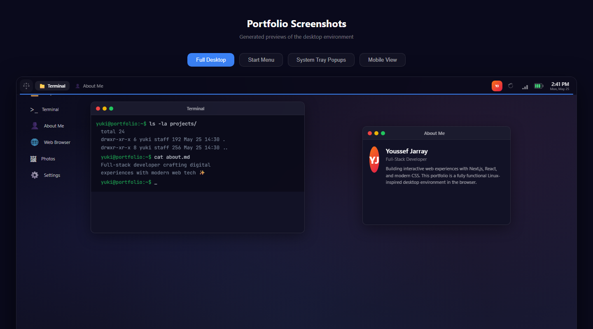
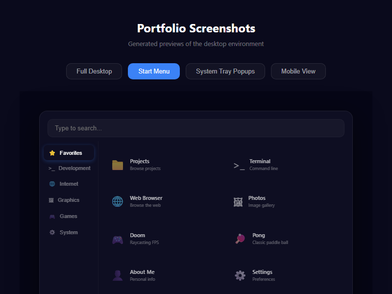
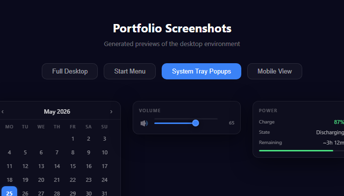
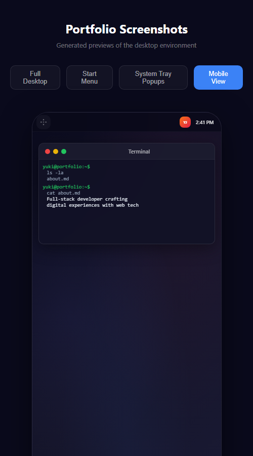

<div align="center">

# 🖥️ GitHub Portfolio

### A fully functional Linux desktop environment in your browser

[](https://nextjs.org/)
[](https://reactjs.org/)
[](https://tailwindcss.com/)
[](https://github.com/pmndrs/zustand)
[](https://www.framer.com/motion/)
[](LICENSE)
[](https://youssefjarray.github.io/)

<br>



*A complete KDE-inspired desktop environment built with Next.js and React*

</div>

---

## ✨ Features

### 🪟 Desktop Environment
- **Draggable windows** with minimize, maximize, and close controls
- **Window manager** with z-index stacking and focus management
- **Taskbar** with running application indicators
- **KDE-style top panel** with application launcher and system tray

### 🎨 System Tray
- **🔊 Volume control** with mute toggle and interactive slider popup
- **📶 WiFi indicator** with signal strength and connection details popup
- **🔋 Battery monitor** with charging status, time remaining, and level bar
- **📅 Calendar popup** with month navigation and date grid
- **🎉 YJ avatar** with confetti burst on click

### 🚀 Applications
| App | Description |
|-----|-------------|
| 📁 **Projects** | Browse portfolio projects with file browser UI |
| >_ **Terminal** | Interactive command-line emulator |
| 👤 **About Me** | Personal info with bio and skills |
| 🌐 **Web Browser** | In-browser web viewer |
| 🖼 **Photos** | Image gallery with filtering |
| ⚙️ **Settings** | System preferences (volume, theme, scale) |
| 🔫 **Doom** | Raycasting FPS game |
| 🏓 **Pong** | Classic paddle ball game |
| ❎ **Tic-Tac-Toe** | 3-in-a-row strategy game |
| 🔢 **Sudoku** | Number puzzle with solver |
| 🧮 **Calculator** | Desktop calculator |
| 💣 **Minesweeper** | Classic mine-finding puzzle |
| 🃏 **Memory** | Card matching game |
| 🎨 **Paint** | Drawing application |
| 📄 **Resume** | PDF viewer for CV |
| 📊 **GitHub Stats** | Repository analytics viewer |

### 🎯 Interactive Elements
- **Context menus** on desktop and window tabs (right-click)
- **Hover previews** for minimized windows
- **Drag & drop widgets** (Analog clock, Sticky note, Cat widget, Music player)
- **Dark/Light theme** toggle with system preference detection
- **Start menu** with app categories and search
- **Desktop icons** with drag-to-reposition

---

## 🖼️ Screenshots

<table>
  <tr>
    <td></td>
    <td></td>
  </tr>
  <tr>
    <td align="center"><em>Application Launcher / Start Menu</em></td>
    <td align="center"><em>System Tray Popups</em></td>
  </tr>
  <tr>
    <td></td>
    <td></td>
  </tr>
  <tr>
    <td align="center"><em>Mobile Responsive View</em></td>
    <td></td>
  </tr>
</table>

---

## 🚀 Getting Started

### Prerequisites
- **Node.js** 16.8+ (for Next.js 13.4)
- **npm** or **pnpm** or **yarn**

### Installation

```bash
# Clone the repository
git clone https://github.com/YoussefJarray/YoussefJarray.github.io.git
cd YoussefJarray.github.io

# Install dependencies
npm install

# Start development server
npm run dev
```

Open [http://localhost:3000](http://localhost:3000) in your browser.

### Build & Deploy

```bash
# Build for production
npm run build

# Deploy to GitHub Pages
npm run deploy
```

---

## 🏗️ Project Structure

```
src/
├── app/                    # Next.js app router
│   ├── globals.css         # Global styles & CSS variables
│   ├── layout.js           # Root layout with fonts
│   └── page.js             # Main page entry (Desktop wrapper)
├── components/             # React components
│   ├── TopPanel.js         # KDE-style top bar with system tray
│   ├── BottomPanel.js      # Taskbar with dock and window manager
│   ├── Desktop.js          # Desktop layout, wallpaper, icons
│   ├── DesktopWidgets.js   # Draggable widgets (clock, sticky note, cat)
│   ├── Window.js           # Draggable/resizable window container
│   ├── WindowManager.js    # Window rendering and focus management
│   ├── ContextMenu.js      # Right-click context menu
│   ├── SettingsApp.js      # Settings application
│   ├── TerminalApp.js      # Terminal emulator
│   ├── BrowserApp.js       # Web browser
│   ├── MusicWidget.js      # Music player
│   ├── PaintApp.js         # Drawing application
│   └── icons/              # Custom SVG game icons
├── store/                  # Zustand state management
│   ├── windowStore.js      # Window positions, states, z-index
│   ├── audioStore.js       # Volume and mute state
│   ├── themeStore.js       # Dark/light theme
│   ├── settingsStore.js    # Persistent settings
│   └── widgetStore.js      # Widget visibility & positions
├── data/                   # Static data & configuration
│   ├── appRegistry.js      # App definitions, icons, categories
│   └── fileSystem.js       # Virtual filesystem structure
└── lib/                    # Utility functions & hooks
    ├── hooks.js            # Custom React hooks
    └── utils.js            # Helper utilities
```

---

## 🧠 Architecture

### State Management (Zustand)
The entire desktop state is managed through lightweight Zustand stores:

- **`windowStore`** — Manages all open windows, their positions, sizes, z-index ordering, minimize/maximize states, and the focused window
- **`audioStore`** — Global volume level and mute state shared across the system tray and music widget
- **`themeStore`** — Dark/light mode with system preference auto-detection and persistence
- **`settingsStore`** — Window scaling factor and other preferences
- **`widgetStore`** — Desktop widget positions and visibility

### Window Manager
Windows use a z-index stacking system where clicking a window brings it to the front. Each window stores:
- Position (x, y) and size (width, height)
- State (open, minimized, maximized)
- Application-specific content via `appId`

### Theming
CSS custom properties (variables) drive all theming:
- `--panel-bg`, `--panel-border`, `--panel-text` — Top/bottom panels
- `--window-bg`, `--window-titlebar` — Window chrome
- `--accent`, `--accent-light` — Accent color (default: blue)
- `--bg-elevated`, `--surface-hover` — Surface levels

Switch between dark and light themes from the Settings app or via the top panel.

---

## 🛠️ Tech Stack

| Technology | Purpose |
|-----------|---------|
| [Next.js 13.4](https://nextjs.org/) | App Router, SSR/SSG, file-system routing |
| [React 18](https://reactjs.org/) | Component UI, hooks, portals |
| [Tailwind CSS 3](https://tailwindcss.com/) | Utility-first styling, responsive design |
| [Zustand 5](https://github.com/pmndrs/zustand) | Lightweight state management |
| [Framer Motion 10](https://www.framer.com/motion/) | Window animations & transitions |
| [React Icons](https://react-icons.github.io/react-icons/) | Icon library (Feather Icons) |
| [Zustand](https://github.com/pmndrs/zustand) | State management |
| [GSAP](https://gsap.com/) | Advanced animations |
| [highlight.js](https://highlightjs.org/) | Code syntax highlighting |
| [wasm-doom](https://github.com/nicbarker/wasm-doom) | DOOM game engine |
| [pdfjs-dist](https://mozilla.github.io/pdf.js/) | PDF rendering |

---

## 🔮 Roadmap

- [ ] **Notification center** — Bell icon with notification history
- [ ] **Workspace switcher** — Multiple virtual desktops
- [ ] **File manager** — Full filesystem browser with file operations
- [ ] **App store** — Browse and install new applications
- [ ] **Screen recording** — Record desktop activity
- [ ] **Bluetooth/WiFi manager** — Network configuration UI
- [ ] **User switcher** — Multiple profile support
- [ ] **Keyboard shortcuts** — Window management hotkeys

---

## 📝 License

This project is [MIT](LICENSE) licensed.

---

<div align="center">
  Built with ❤️ by <a href="https://github.com/YoussefJarray">Youssef Jarray</a>
  <br><br>
  <sub>Inspired by KDE Plasma, GNOME, and Windows Desktop Environments</sub>
</div>
